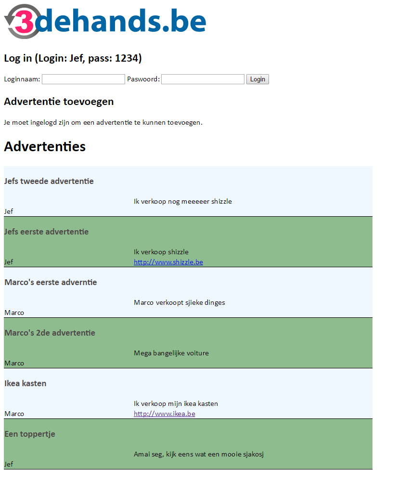
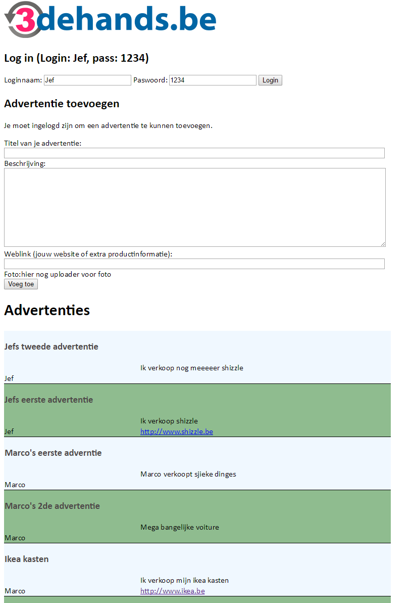

README
======

Dit is een oefening voor mezelf in het kader van de cursus Web Frameworks (AP Hogeschool - Electronica-ICT).

Dit project is een eenvoudige zoekertjeswebsite. De geïmplementeerde functionaliteit omvat:
- inloggen
- plaatsen van advertenties
- tonen van advertenties
- routing naar detailpagina van een advertentie (voorlopig enkel een placeholder)

Nog te voorzien:
- gebruikers accounts laten aanmaken
- foto-uploader

##Installatie / Gebruik

Begin met `npm install`

Start MongoDB op

Start de server met node server.js

Laad localhost:3000

Maak vervolgens in je mongoDB een gebruiker aan, zoals beschreven op regel 47 van *server.js*

Je kunt beginnen met inloggen en het toevoegen van advertenties.

##Screenshots

